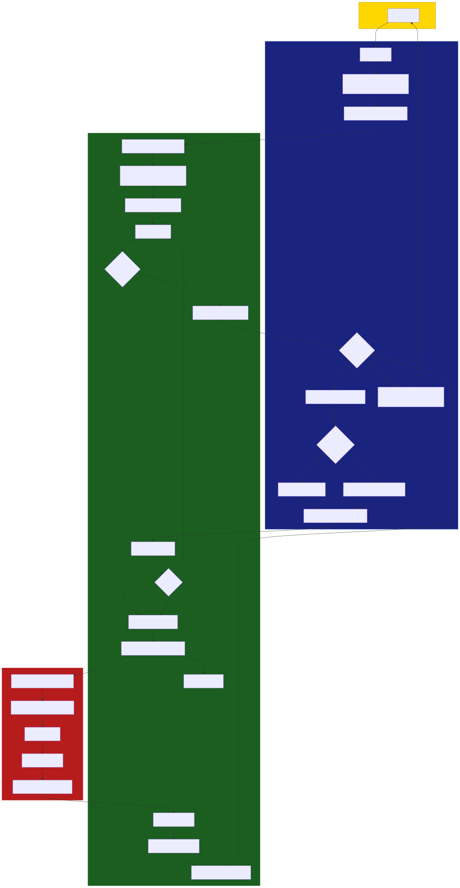
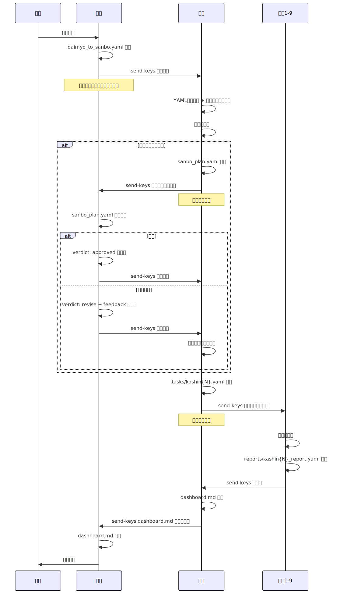

# uesama

<div align="center">

**AI コーディングエージェント マルチ統率システム**

*コマンド1つで、最大11体のAIエージェントが並列稼働*

[](https://opensource.org/licenses/MIT)
[](https://claude.ai)
[](https://github.com/openai/codex)
[](https://github.com/tmux/tmux)

</div>

---

## これは何？

**uesama** は、複数の AI コーディングエージェント（Claude Code / Codex）を戦国時代の軍制のように統率するCLIツールです。

一度インストールすれば、任意のプロジェクトディレクトリで使用できます。

```text
      あなた（上様）
           │
           ▼ 命令を出す
    ┌─────────────┐
    │   DAIMYO    │  ← 命令を受け取り、即座に委譲
    │   (大名)    │
    └──────┬──────┘
           │ YAMLファイル + tmux send-keys
    ┌──────▼──────┐
    │    SANBO    │  ← タスクを分解し家臣に分配
    │   (参謀)    │
    └──────┬──────┘
           │
  ┌─┬─┬─┬─┴─┬─┬─┬─┬─┐
  │1│2│3│4│5│6│7│8│9│  ← 最大9体の家臣が並列実行
  └─┴─┴─┴─┴─┴─┴─┴─┴─┘
      KASHIN (家臣)
```

---

## クイックスタート

### 必要環境

- **tmux** — `brew install tmux` (macOS) / `sudo apt install tmux` (Linux)
- **AI コーディングエージェント**（いずれか1つ）:
  - Claude Code CLI — `npm install -g @anthropic-ai/claude-code`
  - Codex CLI — `npm install -g @openai/codex`

### インストール

```bash
curl -fsSL https://raw.githubusercontent.com/y-nishizaki/uesama/main/install.sh | sh
source ~/.zshrc  # または ~/.bashrc
```

### 使い方

```bash
cd /your/project
uesama              # 全エージェント起動
uesama-session      # セッションに接続
uesama-stop         # 全セッション終了
uesama-update       # uesama を最新版に更新
```

### アンインストール

```bash
cd uesama
./uninstall.sh
```

---

## 仕組み

1. `uesama` がプロジェクトに `.uesama/` ディレクトリを作成
2. tmux セッション `kashindan` を起動（大名+参謀+家臣のペインを配置）
3. 全エージェントで AI コーディングエージェント（Claude Code or Codex）を起動
4. エージェント間は YAML ファイル + tmux send-keys で通信（イベント駆動、ポーリングなし）
5. 進捗は `.uesama/dashboard.md` で確認

---

## アーキテクチャ

| エージェント | 役割 | 数 |
| ----------- | ---- | --- |
| 大名 (Daimyo) | 総大将 — あなたの命令を受け、参謀に委譲 | 1 |
| 参謀 (Sanbo) | 軍師 — タスクを分解し、家臣に割り当て | 1 |
| 家臣 (Kashin) | 実働部隊 — タスクを並列実行 | 9（デフォルト） |

家臣の数は環境変数 `UESAMA_KASHIN_COUNT` で変更できます。

### エージェント設定

`~/.uesama/config/settings.yaml` またはプロジェクトの `.uesama/config/settings.yaml` で設定:

```yaml
agent: claude              # 全ロール共通のデフォルト
agent_daimyo: claude       # 大名のみ指定
agent_sanbo: codex         # 参謀のみ指定
agent_kashin: claude       # 家臣のみ指定
```

環境変数でも上書き可能:

```bash
UESAMA_AGENT=claude                  # 全ロール共通
UESAMA_AGENT_DAIMYO=claude           # 大名のみ
UESAMA_AGENT_SANBO=codex             # 参謀のみ
UESAMA_AGENT_KASHIN=claude           # 家臣のみ
```

### tmux レイアウト

```text
┌──────────┬──────────┬──────────┬──────────┐
│          │ kashin1  │ kashin4  │ kashin7  │
│  大名    ├──────────┼──────────┼──────────┤
│          │ kashin2  │ kashin5  │ kashin8  │
├──────────┼──────────┼──────────┼──────────┤
│  参謀    │ kashin3  │ kashin6  │ kashin9  │
└──────────┴──────────┴──────────┴──────────┘
```

---

## ワークフロー図

### 全体フロー



### 通信プロトコル



詳細は [docs/workflow.md](docs/workflow.md) を参照。

---

## 主な特徴

- **並列実行**: 最大9タスクを同時実行
- **ノンブロッキング**: 命令後すぐ次の命令を出せる
- **イベント駆動**: ポーリングなしでAPI代金を節約
- **CLIインストール**: 一度入れればどのプロジェクトでも使える

---

## クレジット

[multi-agent-shogun](https://github.com/yohey-w/multi-agent-shogun)（yohey-w）をベースに開発。原型は [Claude-Code-Communication](https://github.com/Akira-Papa/Claude-Code-Communication)（Akira-Papa）。

## ライセンス

MIT License — 詳細は [LICENSE](LICENSE) を参照。
