# uesama ワークフロー図

## 全体フロー

```mermaid
flowchart TD
    subgraph Human["👑 上様（人間）"]
        U[指示入力]
    end

    subgraph Daimyo["🏯 大名（プロジェクト統括）"]
        D1[指示受領]
        D2["YAML作成<br/>daimyo_to_sanbo.yaml"]
        D3["send-keys で参謀を起こす"]
        D4{通知の種類?}
        D5["sanbo_plan.yaml を読む"]
        D6{計画レビュー}
        D7["verdict: approved<br/>daimyo_to_sanbo.yaml に書く"]
        D8["verdict: revise + feedback<br/>daimyo_to_sanbo.yaml に書く"]
        D9["dashboard.md を読んで<br/>殿に報告"]
        D10["send-keys で参謀を起こす"]
    end

    subgraph Sanbo["⚔️ 参謀（タスク管理・分配）"]
        S1["起こされる（send-keys）"]
        S2["daimyo_to_sanbo.yaml 読む"]
        S3["コンテキスト読み込み<br/>global_context.md / projects.yaml"]
        S4[タスク分解]
        S5{承認が必要?}
        S6["sanbo_plan.yaml 作成<br/>send-keys で大名に通知"]
        S7["承認結果を確認"]
        S8{verdict?}
        S9["各家臣にYAML作成<br/>tasks/kashin{N}.yaml"]
        S10["send-keys で家臣を起こす"]
        S11[停止して待機]
        S12["報告YAML受信<br/>reports/kashin{N}_report.yaml"]
        S13["dashboard.md 更新"]
        S14["send-keys で大名に通知"]
    end

    subgraph Kashin["🗡️ 家臣1〜8（実働部隊）"]
        K1["起こされる（send-keys）"]
        K2["tasks/kashin{N}.yaml 読む"]
        K3[タスク実行]
        K4["報告YAML作成<br/>reports/kashin{N}_report.yaml"]
        K5["send-keys で参謀に通知"]
    end

    %% メインフロー
    U --> D1
    D1 --> D2
    D2 --> D3
    D3 --> S1

    %% 参謀のタスク処理
    S1 --> S2
    S2 --> S3
    S3 --> S4
    S4 --> S5

    %% 承認分岐
    S5 -->|"承認必要<br/>・大規模変更<br/>・家臣3人以上<br/>・破壊的変更<br/>・コンテキスト不足"| S6
    S5 -->|"承認不要<br/>・新規ファイルのみ<br/>・家臣1〜2人<br/>・具体的な指示"| S9

    %% 承認フロー
    S6 --> D4
    D4 -->|計画承認| D5
    D5 --> D6
    D6 -->|承認| D7
    D6 -->|修正要求| D8
    D7 --> D10
    D8 --> D10
    D10 --> S7
    S7 --> S8
    S8 -->|approved| S9
    S8 -->|revise| S4

    %% 家臣へのタスク配布
    S9 --> S10
    S10 --> K1
    S10 --> S11

    %% 家臣の実行
    K1 --> K2
    K2 --> K3
    K3 --> K4
    K4 --> K5

    %% 報告フロー
    K5 --> S12
    S12 --> S13
    S13 --> S14
    S14 --> D4
    D4 -->|完了報告| D9
    D9 --> U

    %% スタイリング
    style Human fill:#FFD700,stroke:#B8860B,color:#000
    style Daimyo fill:#1a237e,stroke:#0d47a1,color:#fff
    style Sanbo fill:#1b5e20,stroke:#2e7d32,color:#fff
    style Kashin fill:#b71c1c,stroke:#c62828,color:#fff
```



## 通信プロトコル

```mermaid
sequenceDiagram
    participant U as 👑 上様
    participant D as 🏯 大名
    participant S as ⚔️ 参謀
    participant K as 🗡️ 家臣1〜8

    U->>D: 指示入力
    D->>D: daimyo_to_sanbo.yaml 作成
    D->>S: send-keys で起こす
    Note over D: 即終了（殿は次の入力可能）

    S->>S: YAML読み込み + コンテキスト確認
    S->>S: タスク分解

    alt 承認が必要な場合
        S->>S: sanbo_plan.yaml 作成
        S->>D: send-keys「計画案を提出した」
        Note over S: 停止して待機
        D->>D: sanbo_plan.yaml レビュー
        alt 承認
            D->>D: verdict: approved を書く
            D->>S: send-keys で起こす
        else 修正要求
            D->>D: verdict: revise + feedback を書く
            D->>S: send-keys で起こす
            S->>S: 計画修正して再提出
        end
    end

    S->>S: tasks/kashin{N}.yaml 作成
    S->>K: send-keys で起こす（並列）
    Note over S: 停止して待機

    K->>K: タスク実行
    K->>K: reports/kashin{N}_report.yaml 作成
    K->>S: send-keys で報告

    S->>S: dashboard.md 更新
    S->>D: send-keys「dashboard.md を更新した」
    D->>D: dashboard.md 確認
    D->>U: 結果報告
```



## エスカレーションフロー

```mermaid
flowchart LR
    subgraph 大名が自律判断
        A1[タスクの承認/否認]
        A2[次のタスクの指示]
        A3[軽微な方針調整]
        A4[品質チェックの合否]
    end

    subgraph Escalation["上様に判断を仰ぐ（要対応）"]
        B1[セキュリティ問題]
        B2[大規模な方針変更]
        B3[コスト影響のある判断]
        B4[要件の根本的な変更]
        B5[判断に迷う重要事項]
    end

    大名が自律判断 -->|通常| 処理続行
    Escalation -->|dashboard.md 経由| 上様の判断待ち
```

## ファイル構成

```mermaid
graph LR
    subgraph Queue["📂 .uesama/queue/"]
        Q1["daimyo_to_sanbo.yaml<br/>大名→参謀 指示"]
        Q2["sanbo_plan.yaml<br/>参謀→大名 計画承認"]
        subgraph Tasks["tasks/"]
            T1["kashin1.yaml"]
            T2["kashin2.yaml"]
            T3["..."]
            T8["kashin8.yaml"]
        end
        subgraph Reports["reports/"]
            R1["kashin1_report.yaml"]
            R2["kashin2_report.yaml"]
            R3["..."]
            R8["kashin8_report.yaml"]
        end
    end

    subgraph Status["📊 ステータス"]
        S1[".uesama/dashboard.md<br/>参謀が更新"]
        S2[".uesama/dashboard_archive/<br/>YYYY-MM-DD.md"]
    end

    subgraph Config["⚙️ 設定"]
        C1[".uesama/config/projects.yaml"]
        C2[".uesama/config/settings.yaml"]
        C3[".uesama/memory/global_context.md"]
    end
```



## 並列化ルール

```mermaid
graph TD
    subgraph "✅ 並列実行OK"
        P1[家臣1: fileA.ts 作成] --> 完了1
        P2[家臣2: fileB.ts 作成] --> 完了2
        P3[家臣3: fileC.ts 作成] --> 完了3
    end

    subgraph "❌ 競合禁止 RACE-001"
        X1["家臣1: output.md 書込"] -.- X2["家臣2: output.md 書込"]
        style X1 fill:#ff6666,stroke:#cc0000
        style X2 fill:#ff6666,stroke:#cc0000
    end

    subgraph "✅ 逐次実行（依存あり）"
        SEQ1[家臣1: DB作成] --> SEQ2[家臣2: マイグレーション]
        SEQ2 --> SEQ3[家臣3: シード投入]
    end
```
